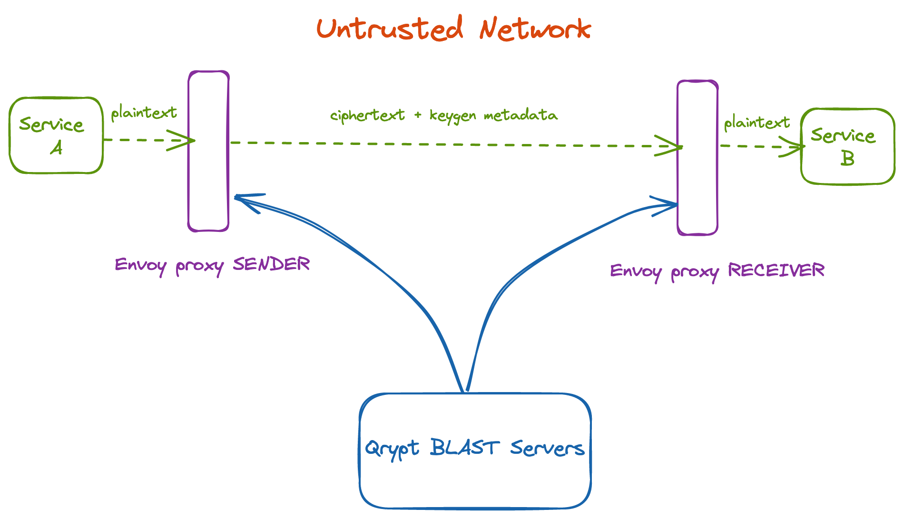

# Secure Tunnel Quickstart

This repository contains a demo application for Qrypt's Secure Tunnel product.
It is meant for demonstration purposes only, and is not suitable for a production environment.

## Introduction
---

Secure Tunnel is a custom Envoy HTTP filter that can be used to enable quantum secure
transmission channels across untrusted networks. 

This is achieved by installing Envoy proxies on both ends of a channel. These proxies
use Qrypt's distributed key generation technology to perform quantum secure One Time Pad
encryption/decryption on each end, without ever storing or transmitting any keys. 



## Docker Image
---

Secure Tunnel is publicly available as an image on Docker Hub.

```bash
docker pull qryptdev001/securetunnel-envoy:1.0.0
```
The image contains a custom build of Envoy with Secure Tunnel statically linked into it.

The executable is at `/usr/local/bin/envoy`.

## Requirements
---

To run this demo you will need to:

1. Install `docker-compose`
2. Create a Qrypt [portal](https://portal.qrypt.com) account
3. Generate a Qrypt keygen token (this can be done on the portal)
    a. When generating the token, ensure that it has the `keygen` scope

## Setup
---

In `proxies/envoy.sender.yml` and `proxies/envoy.receiver.yml`, replace the `{YOUR_QRYPT_TOKEN}` placeholder with a valid usage token. Then, run

```bash
$ docker-compose up --build
```

## Demo 
---

The services in this demo are intended to give the user a means of inspecting an arbitrary message as it passes through the various stages of encryption and decryption.

The `entrypoint` service listens for `POST` requests on port `3000` on the host. 

> **NOTE:**   Requests must have a `Content-Type: application/json` header.

Requests are logged and forwarded to the Envoy `sender-proxy`, which then forwards the request to an intermediary `eavesdropper` service. 

The `eavesdropper` service logs the message it receives from the `sender-proxy` before forwarding it to the `listener-proxy`.

The `listener-proxy` then decrypts the message and forwards it to the `recipient` service, which finally logs the decrypted plaintext message. 


To send a message through the demo tunnel, run

```bash
$ curl -d '{"someKey":"someValue"}' -H "Content-Type: application/json" -X POST http://localhost:3000
```
